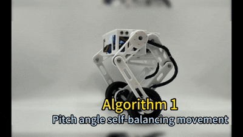
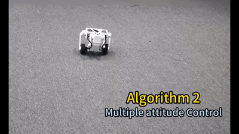
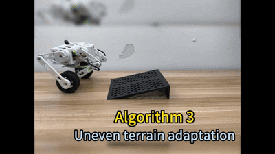

# 🤖 Mini Wheeled-Legged Robot | Full-Stack Development Tutorial

Welcome to the **Mini Wheeled-Legged Robot Tutorial Track**! This is a systematic, engineering-oriented masterclass designed for creators who want to bridge the gap between theory and hardware.

Whether you're looking for a hardcore career transition, completing your capstone project, or simply want to build a "run-and-jump" piece of high-tech gear from scratch—this is your starting line! 🚀

<a href="https://www.seeedstudio.com/StackForce-Mini-Wheeled-Legged-Robot-p-6710.html" style="
    background-color: #4CAF50;
    color: white;
    padding: 10px 25px;
    text-align: center;
    text-decoration: none;
    display: inline-block;
    border-radius: 8px;
    font-weight: bold;
    font-family: sans-serif;
">
   🛒 Get One Now 🖱️
</a>

---

### ❓ Why Wheeled-Legged?

The **Wheeled-Legged Robot** is the **ultimate high-mobility chassis**, perfectly fusing wheel efficiency with bionic obstacle-clearing power. Because its complex dynamic balancing and kinematics are often viewed as "too hard," it remains an elite, overlooked niche—exactly where your competitive edge lies.

We don't just move pixels; we move motors. This course skips the fluff to help you conquer the steep learning curve, transforming you from a hobbyist into a robotics engineer capable of true, high-performance bionic mobility. 🦾

## 💡 Why This Tutorial?

We skip the fluff and focus on the **"Physical Meaning → Control Logic → Deployable Code"** workflow. You won't just copy-paste; you’ll understand the *inner soul* of the robot.

* **Real-World Engineering**: Built around a fully functional, physical wheeled-legged platform.
* **Deep Problem Solving**: Master pitch balancing, terrain adaptation, and parallel link kinematics.
* **Intuition-First**: We explain *why* an algorithm is designed before showing you *how* it's coded.
* **Future-Proof**: Build a rock-solid foundation for **Advanced control algorithm** and advanced robotics research.

## 🛠️ Core Skills You Will Master

| Phase | Core Module | Key Technologies & Breakthroughs |
| :--- | :--- | :--- |
| **01** | **ESP32 Embedded Development** | Servo & Motor control, IMU (I2C/SPI) data processing, Bluetooth RC data transmission |
| **02** | **Fundamental Self-Balancing** | Pitch closed-loop (PID), velocity loops, multi-sensor weight calibration |
| **03** | **Terrain Adaptation** | Attitude feedback control, dynamic CoM (Center of Mass) adjustment, ground normal estimation |
| **04** | **High Mobility & Interaction** | Parallel leg kinematics, foot-end force control, remote control logic, stability tuning |
| **05** | **Integrated Applications** | Complex maneuver planning, multi-sensor synergy, system-wide stability optimization |

|||
| :---: | :---: |
|||

## 📚 Course Outline

- [Chapter 1. Introduction](1.Introduction/README.md)
- [Chapter 2. Pitch angle self-balancing movement](<2.Pitch angle self-balancing movement/README.md>)
- [Chapter 3. Attitude Control + Terrain Adaptation](<3.Attitude Control + Terrain Adaptation/README.md>)
- [Chapter 4. Bionic legs achieve high-performance mobility](<4.Bionic legs achieve high-performance mobility/README.md>)

---

### 🎯 Who Is This For?

* **Students** in Robotics, Automation, or Mechatronics looking for a hardcore project.
* **Developers** with basic embedded experience (IMUs, Encoders, PID) ready to level up.
* **Tech Enthusiasts** obsessed with the cutting edge of bionic motion.

---

> **"Theory is when you know everything but nothing works. Practice is when everything works but no one knows why. Here, we do both: everything works, and we know exactly why."**

#Robotics #WheeledLegged #PID #ControlTheory #EmbeddedSystems #Bionics #EngineeringLife

---

*Happy Learning and Welcome to the World of Robotics!*

